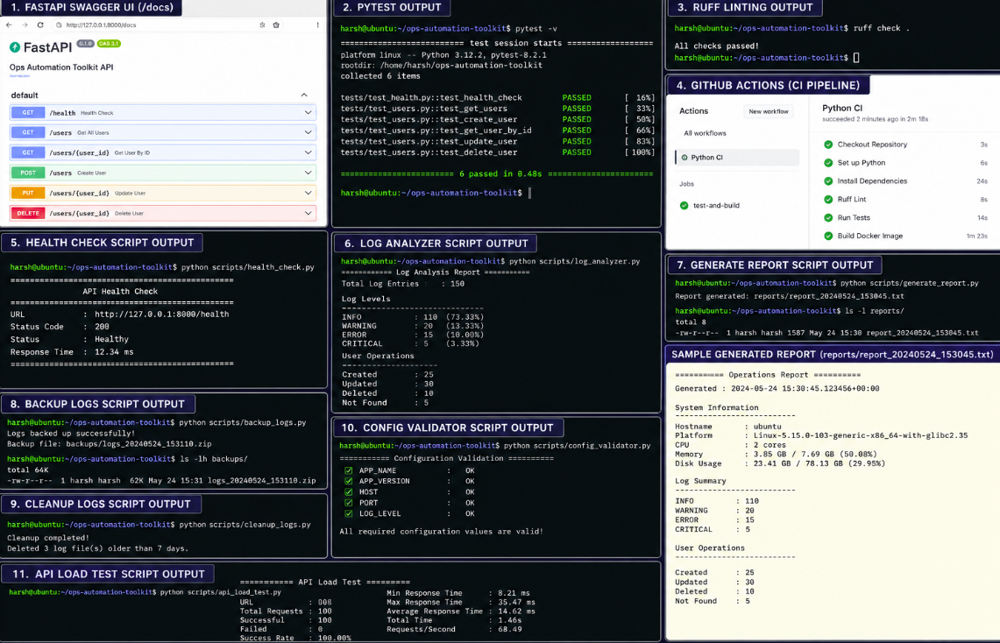

# Ops Automation Toolkit


A lightweight DevOps automation toolkit built around a simple FastAPI application. The application generates operational logs and exposes REST APIs, while a collection of Python automation scripts performs common DevOps tasks such as health checks, log analysis, report generation, backups, and configuration validation.

The goal of this project is to demonstrate practical Python automation skills commonly used by DevOps engineers rather than building a feature-rich backend application.

---

## Project Overview




---
## Features

* FastAPI REST API with CRUD operations
* Request and application logging
* Environment-based configuration using `.env`
* Docker and Docker Compose support
* GitHub Actions CI pipeline
* Ruff linting
* Pytest-based API tests
* Python automation scripts for common operational tasks

---

## Project Structure

```text
ops-automation-toolkit/
├── app/
│   ├── config.py
│   ├── data.py
│   ├── logger.py
│   ├── main.py
│   └── models.py
│
├── scripts/
│   ├── api_load_test.py
│   ├── backup_logs.py
│   ├── cleanup_logs.py
│   ├── config_validator.py
│   ├── generate_report.py
│   ├── health_check.py
│   └── log_analyzer.py
│
├── logs/
├── reports/
├── backups/
├── tests/
├── .github/
│   └── workflows/
│       └── ci.yml
├── Dockerfile
├── docker-compose.yml
├── requirements.txt
└── README.md
```

---

## Automation Scripts

| Script                | Description                                                           |
| --------------------- | --------------------------------------------------------------------- |
| `health_check.py`     | Checks API availability and response time                             |
| `log_analyzer.py`     | Parses application logs and summarizes log levels and user operations |
| `api_load_test.py`    | Sends multiple requests to evaluate API responsiveness                |
| `backup_logs.py`      | Creates timestamped ZIP backups of application logs                   |
| `cleanup_logs.py`     | Removes log files older than the configured retention period          |
| `generate_report.py`  | Generates a system and log summary report                             |
| `config_validator.py` | Validates required configuration values from the `.env` file          |

---

## API Endpoints

| Method | Endpoint      | Description              |
| ------ | ------------- | ------------------------ |
| GET    | `/health`     | Application health check |
| GET    | `/users`      | Retrieve all users       |
| GET    | `/users/{id}` | Retrieve a user          |
| POST   | `/users`      | Create a user            |
| PUT    | `/users/{id}` | Update a user            |
| DELETE | `/users/{id}` | Delete a user            |

---

## Getting Started

### Clone the repository

```bash
git clone https://github.com/hs2002-18/ops-automation-toolkit.git
cd ops-automation-toolkit
```

### Create a virtual environment

```bash
python -m venv .venv
```

Linux/macOS

```bash
source .venv/bin/activate
```

Windows

```bash
.venv\Scripts\activate
```

### Install dependencies

```bash
pip install -r requirements.txt
```

---

## Environment Variables

Create a `.env` file in the project root.

Example:

```env
APP_NAME=Ops Automation Toolkit
APP_VERSION=1.0.0
HOST=0.0.0.0
PORT=8000
LOG_LEVEL=INFO
```

---

## Run the Application

### Using Uvicorn

```bash
uvicorn app.main:app --reload
```

Open:

```
http://127.0.0.1:8000/docs
```

---

### Using Docker

```bash
docker compose up --build
```

---

## Run Automation Scripts

Health Check

```bash
python scripts/health_check.py
```

Analyze Logs

```bash
python scripts/log_analyzer.py
```

Generate Report

```bash
python scripts/generate_report.py
```

Backup Logs

```bash
python scripts/backup_logs.py
```

Cleanup Logs

```bash
python scripts/cleanup_logs.py
```

Validate Configuration

```bash
python scripts/config_validator.py
```

API Load Test

```bash
python scripts/api_load_test.py
```

---

## Running Tests

```bash
pytest
```

---

## Continuous Integration

The GitHub Actions workflow automatically performs the following on every push and pull request:

* Install project dependencies
* Run Ruff linting
* Execute Pytest test cases
* Build the Docker image

---

## Technologies Used

* Python
* FastAPI
* Docker
* Docker Compose
* GitHub Actions
* Ruff
* Pytest
* Requests
* Psutil
* Python-dotenv

---

## Future Enhancements

* Export reports in HTML format
* Email report notifications
* Kubernetes deployment manifests
* Helm chart
* Prometheus metrics endpoint
* Grafana dashboard

---

## Author

**Harsh Shrimali**

GitHub: https://github.com/hs2002-18
